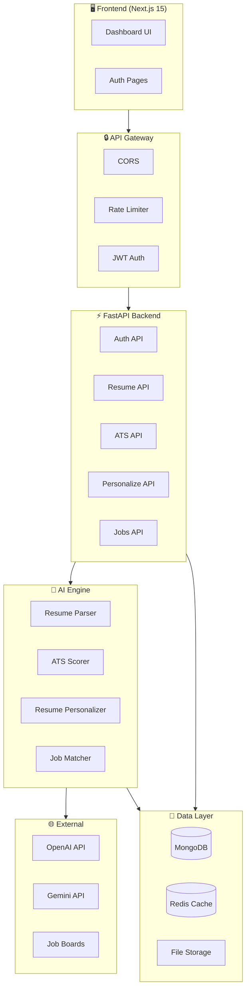
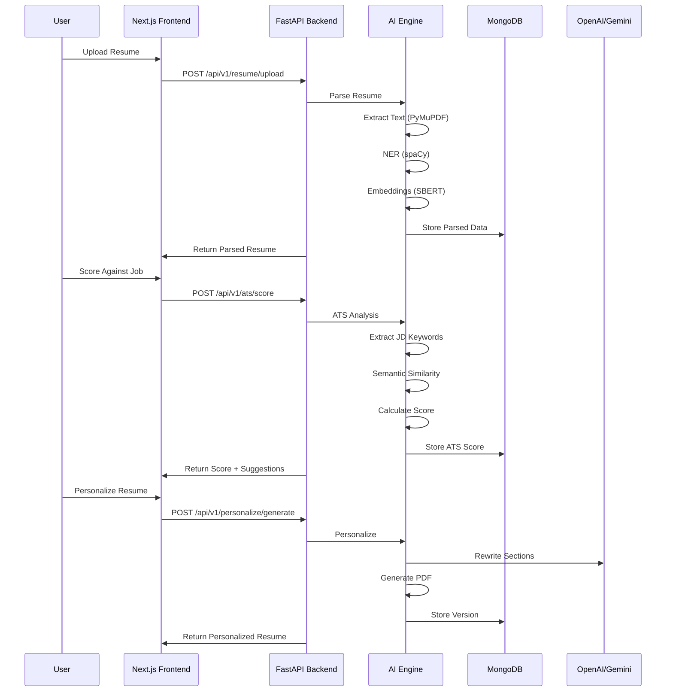
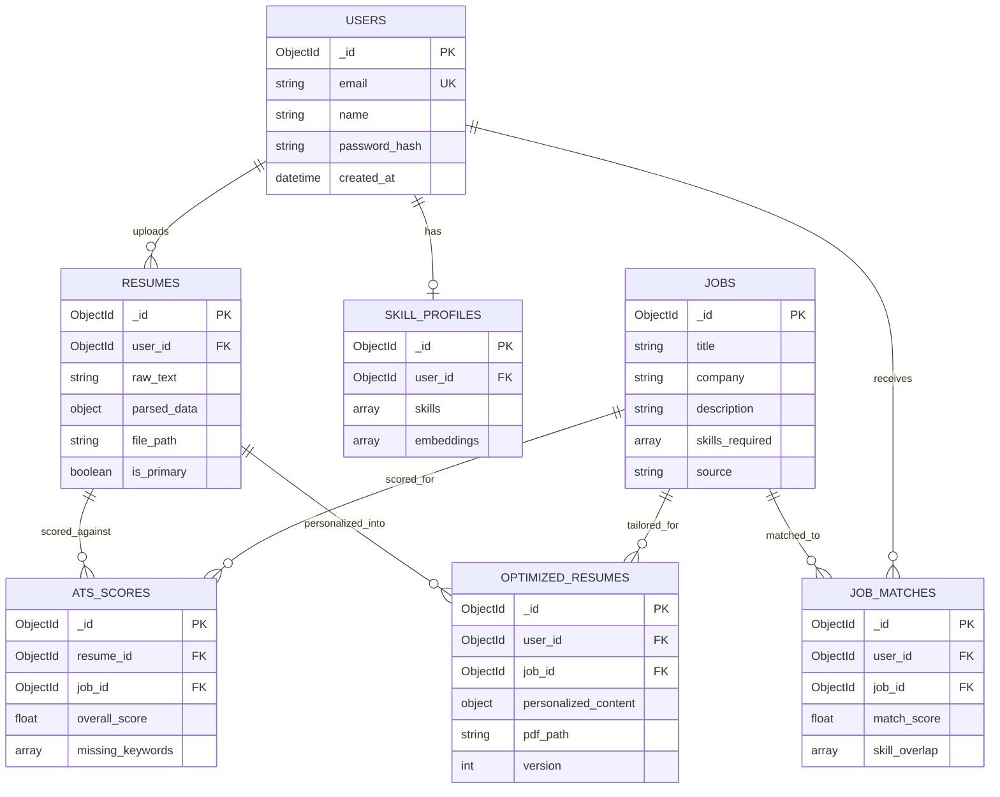

# RecruitAI — System Architecture

## High-Level Architecture

## Service Communication Flow

## Database Architecture

## Technology Stack

| Layer | Technology | Purpose |
|---|---|---|
| Frontend | Next.js 15, shadcn/ui, Recharts | Dashboard UI |
| Backend | FastAPI, Pydantic, Uvicorn | REST API |
| Database | MongoDB 7 (Motor async) | Document storage |
| Cache | Redis 7 | Sessions, caching |
| AI/NLP | spaCy, sentence-transformers, KeyBERT | Text analysis |
| LLM | OpenAI GPT-4 / Google Gemini | Content generation |
| PDF | WeasyPrint | Resume PDF generation |
| Auth | JWT (python-jose), bcrypt | Authentication |
| Containers | Docker, Docker Compose | Development & deployment |
